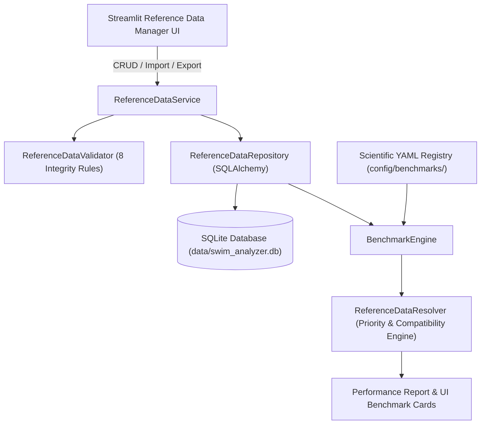

# Reference Data Manager — Architecture & User Documentation

## 1. Overview
The **Reference Data Manager** is an integrated data management subsystem within Swim_Analyzer_AI. It enables coaches, sports scientists, and administrators to create, edit, validate, import, export, and inspect swimming reference datasets across all four competitive strokes:
- **Freestyle**
- **Backstroke**
- **Breaststroke**
- **Butterfly**

The Reference Data Manager coexists with the authoritative, scientifically curated peer-reviewed **YAML Benchmark Registry** (`config/benchmarks/*.yaml`) and extends it with local, team, and coach-defined reference datasets.

---

## 2. Architecture & Data Flow

---

## 3. Database Schema (SQLite via SQLAlchemy)

### `reference_datasets`
- `dataset_id` (PK, VARCHAR)
- `name` (VARCHAR, Indexed)
- `description` (TEXT)
- `stroke` (VARCHAR: `FREESTYLE`, `BACKSTROKE`, `BREASTSTROKE`, `BUTTERFLY`, `ALL`)
- `age_min` (INTEGER), `age_max` (INTEGER)
- `sex` (VARCHAR: `Male`, `Female`, `Mixed`, `Unknown`)
- `skill_level` (VARCHAR: `Beginner`, `Intermediate`, `Advanced`, `Elite`, `Unknown`)
- `athlete_category` (VARCHAR: `Youth`, `Adult`, `Masters`, `Sprinter`, `Distance`, `IM`, `Custom`)
- `source_type` (VARCHAR: `PEER_REVIEWED_PRIMARY_STUDY`, `PEER_REVIEWED_SYSTEMATIC_REVIEW`, `PEER_REVIEWED_META_ANALYSIS`, `VALIDATED_TEAM_DATA`, `COACH_DEFINED`, `IMPORTED_REFERENCE`, `UNKNOWN`)
- `evidence_status` (VARCHAR: `INSUFFICIENT_EVIDENCE`, `AVAILABLE`)
- `benchmark_eligibility` (VARCHAR: `BENCHMARK`, `CONTEXT_ONLY`, `NOT_ELIGIBLE`, `INSUFFICIENT_EVIDENCE`)
- `validation_status` (VARCHAR: `DRAFT`, `PENDING_REVIEW`, `COACH_VALIDATED`, `SCIENTIFICALLY_VALIDATED`, `REJECTED`)
- `is_archived` (INTEGER: `0` or `1`)
- `created_at` (VARCHAR), `updated_at` (VARCHAR)

### `reference_metrics`
- `metric_id` (PK, VARCHAR)
- `dataset_id` (FK → `reference_datasets.dataset_id`)
- `metric_name` (VARCHAR: e.g., `stroke_rate`, `stroke_length`, `dps`, `body_roll`)
- `display_name` (VARCHAR)
- `value_min`, `value_typical`, `value_median`, `value_max` (FLOAT, nullable)
- `unit` (VARCHAR: e.g., `spm`, `m`, `deg`, `sec`, `%`)
- `measurement_domain` (VARCHAR: `CALIBRATED_PHYSICAL`, `RELATIVE_BODY_NORMALIZED`, `POSE_RELATIVE_3D`, `IMAGE_SPACE`, `UNAVAILABLE`)
- `status` (VARCHAR: `available`, `unavailable`)
- `method` (VARCHAR), `notes` (TEXT)

### `reference_sources`
- `source_id` (PK, VARCHAR)
- `dataset_id` (FK → `reference_datasets.dataset_id`)
- `source_type` (VARCHAR), `source_title` (TEXT), `authors` (TEXT), `publication_year` (INTEGER)
- `doi` (VARCHAR), `pmid` (VARCHAR), `url` (VARCHAR), `sample_size` (INTEGER), `population_description` (TEXT)

### `reference_validation_events`
- `event_id` (PK, VARCHAR)
- `dataset_id` (FK → `reference_datasets.dataset_id`)
- `timestamp` (VARCHAR), `user` (VARCHAR), `action` (VARCHAR: `CREATE`, `EDIT`, `VALIDATE`, `REJECT`, `ARCHIVE`, `IMPORT`, `EXPORT`, `DELETE`), `old_status` (VARCHAR), `new_status` (VARCHAR), `notes` (TEXT)

---

## 4. Scientific Integrity & Validation Rules

1. **RULE 1**: `COACH_DEFINED` datasets default to `benchmark_eligibility = CONTEXT_ONLY`. They cannot automatically become scientific benchmarks.
2. **RULE 2**: Peer-reviewed studies may become `BENCHMARK` only if complete source citations (authors, title, DOI/PMID, year) and sample sizes are verified.
3. **RULE 3**: Youth (`age_max <= 17`) and Masters (`age_min >= 36`) data are isolated and never silently treated as adult general population benchmarks.
4. **RULE 4**: Coach-entered datasets display disclaimer: `"Coach-defined reference — not a universal scientific benchmark."`
5. **RULE 5**: Imported CSV data initially defaults to `status = DRAFT`, `benchmark_eligibility = CONTEXT_ONLY`.
6. **RULE 6**: Range ordering validation (`min <= typical <= max` and `min <= median <= max`) evaluated only when non-None. Null values remain Null.
7. **RULE 7**: No automatic averaging of unrelated populations.
8. **RULE 8**: Prevent invalid dataset merging with incompatible stroke, age, sex, skill level, measurement domain, or unit.

---

## 5. CSV Import & Export Specification

### CSV Headers
`dataset_name,stroke,age_min,age_max,sex,skill_level,athlete_category,metric_name,value_min,value_typical,value_median,value_max,unit,measurement_domain,status,method,source_type,source_title,authors,publication_year,doi,pmid,url,sample_size`

### Export Formats
- **CSV**: Flat tabular export.
- **JSON**: Hierarchical dataset object array.
- **YAML**: Standard structured format compatible with the scientific benchmark registry.
